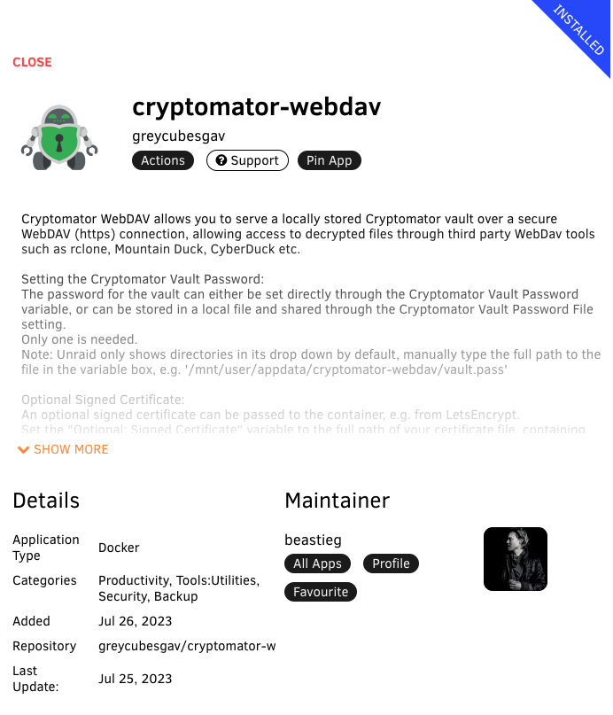

# Greycubesgav Unraid Templates

This repository contains my templates for Unraid.

Currently includes:

* cryptomator-webdav : Runs the cryptomaotr-cli application wrapped in an stunnel TLS connection to provide access to a Cryptomator vault over WebDAVS.

  

